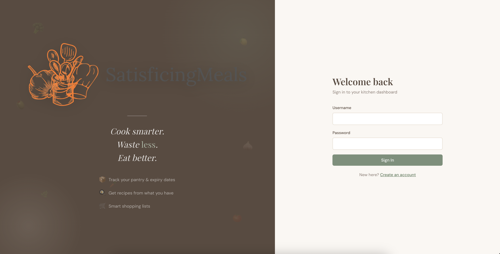
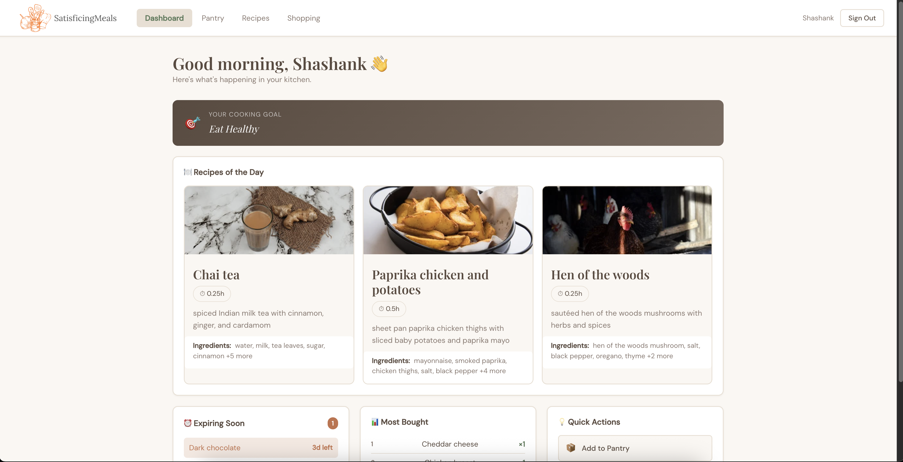
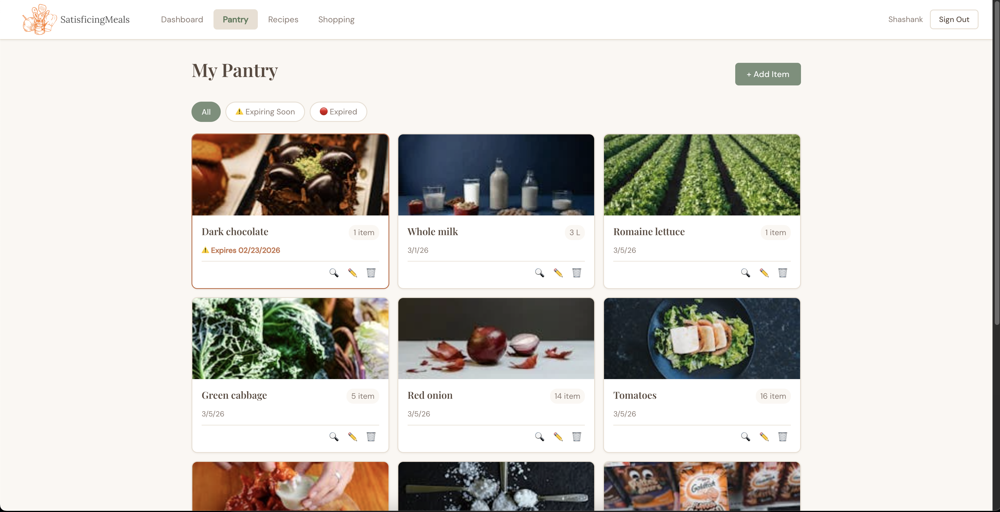
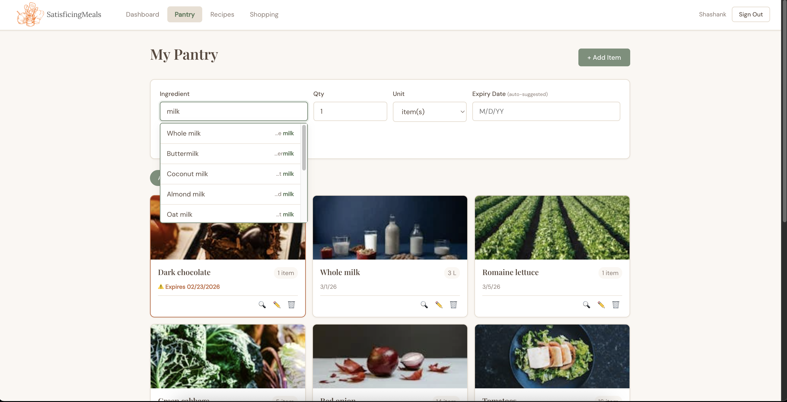
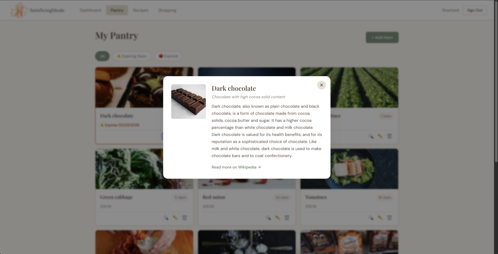
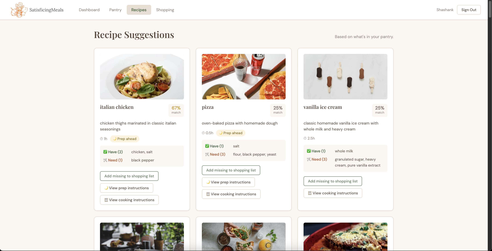
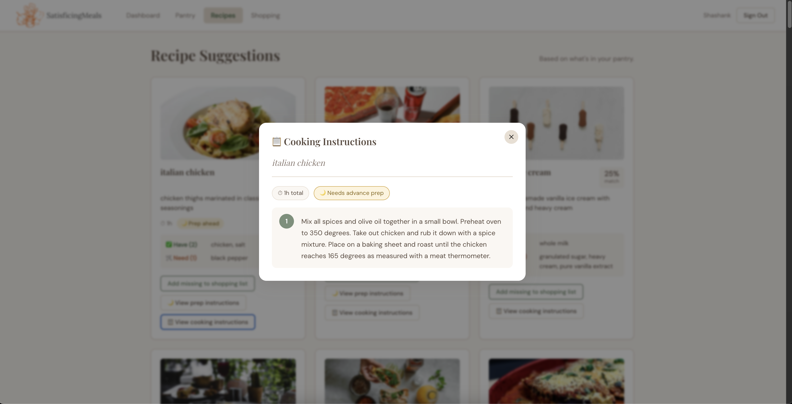
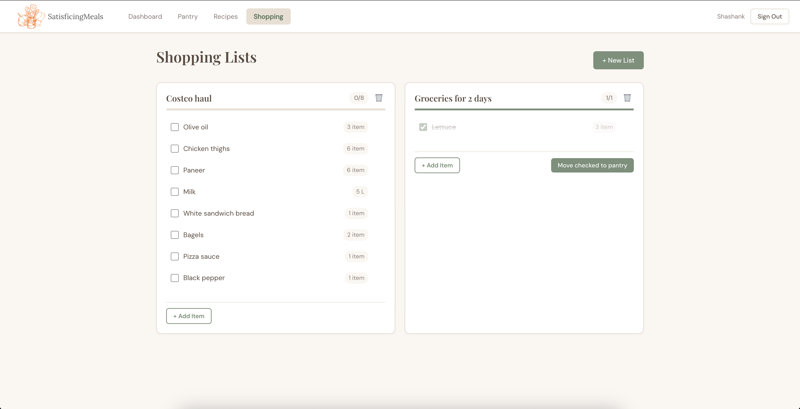

# SatisficingMeals — Track Your Groceries, Reduce Waste, Plan Meals

## Author & Class Info

- **Authors:** [Shashank More](https://shashankmore20.github.io/cs5610-Project1/) & [Sarah Gillespie](https://sarahgillespie.github.io/sarah-gillespie-homepage/)
- **Class:** CS5610 Web Development — Northeastern University
- **Deployed:** [satisficingmeals.onrender.com](https://satisficingmeals.onrender.com/)
- **GitHub:** [github.com/Shashankmore20/SatisficingMeals](https://github.com/Shashankmore20/SatisficingMeals)
- **Slides:** [Google Slides](https://docs.google.com/presentation/d/1e2AYU5_qWhqYLUPDUOzLA5Z1_5bqZhFyau5e3wwjaNg/edit?usp=sharing)

---

## Project Objective

SatisficingMeals solves the problem of uninspiring meals, busy weeknights, and food waste by helping users track what's in their pantry, when items expire, and recipes they can make. Users add items to their virtual pantry — the system suggests expiry dates automatically. The dashboard highlights items expiring soon so nothing goes to waste.

The app goes beyond tracking. It suggests meals you can make with what you already have, generates a grocery list, and sends reminders for ingredient prep (like marinating tomorrow's chicken or setting pizza dough to rise). Users can look up unfamiliar ingredients via Wikipedia, and the app tracks purchase history to show frequently bought items.

---

## Screenshots

| View | Screenshot |
| ---- | ---------- |
| Login |  |
| Dashboard |  |
| Pantry |  |
| AddItem |  |
| Wiki |  |
| Recipes |  |
| CookingInstructions |  |
| ShoppingLists |  |

---

## Video Demonstration

[Watch Video Demo](https://drive.google.com/file/d/1eb5GrJaIUBDCEL1qh0a8BozlK1JeDiY-/view?usp=drive_link)

---

## Instructions to Build / Run

1. Clone the repository

   ```bash
   git clone https://github.com/Shashankmore20/SatisficingMeals.git
   cd SatisficingMeals
   ```

2. Install dependencies

   ```bash
   npm install
   ```

3. Set up environment variables

   ```bash
   cp .env.example .env
   # Edit .env with your MongoDB URI, session secret, and Pexels API key
   ```

4. Start the server

   ```bash
   npm run dev       # development (auto-restart)
   npm start         # production
   ```

5. Open [http://localhost:3000](http://localhost:3000) in your browser

   A successful start looks like:
   ```
   Connected to MongoDB: satisficingmeals
   SatisficingMeals running on http://localhost:3000
   ```

---

## Tech Stack

- **Backend:** Node.js + Express (ES Modules, no CJS)
- **Database:** MongoDB Atlas (native driver — no Mongoose)
- **Frontend:** Vanilla JavaScript (client-side rendering, no framework)
- **Auth:** express-session + bcrypt
- **Images:** Pexels API (proxied through backend)
- **Linting:** ESLint 9 (flat config) + Prettier

---

## Rubric Checklist

| **Criteria** | **Status / Link** |
| --- | --- |
| Design Document (description, personas, stories, mockups) | [View Design Doc](./submissions/DesignDoc.pdf) |
| App accomplishes all approved requirements | ✔ Pantry, recipes, shopping, auth, analytics |
| App is usable and includes instructions | ✔ (this README + in-app hints) |
| App is actually useful | ✔ Reduces food waste, suggests meals |
| ESLint config — no errors | ✔ `npm run lint` → 0 errors |
| Code properly organized | ✔ `backend/routes/`, `backend/db/`, `frontend/js/`, `frontend/css/` |
| JS organized in modules | ✔ api.js, auth.js, pantry.js, recipes.js, shopping.js, wikipedia.js |
| Client-side rendering with vanilla JS | ✔ No framework, all DOM manipulation in JS modules |
| At least 1 form | ✔ Login, signup, pantry add, shopping list add |
| Deployed on public server | ✔ [satisficingmeals.onrender.com](https://satisficingmeals.onrender.com/) |
| 2+ Mongo collections with CRUD | ✔ pantry_items, shopping_lists, users, purchase_history |
| Database with 1,000+ records | ✔ `all_possible_ingredients` collection has 1,000+ documents |
| Uses Node + Express | ✔ server.js with Express 4 |
| Formatted with Prettier | ✔ `npm run format` applied |
| No non-standard tags for standard components | ✔ Proper `<button>`, `<form>`, `<input>`, `<nav>` throughout |
| CSS organized by modules | ✔ main.css, auth.css, pantry.css, shopping.css |
| Clear descriptive README | ✔ (this file) |
| No exposed credentials | ✔ `.env` gitignored, `.env.example` provided |
| package.json with all dependencies | ✔ [package.json](./package.json) |
| MIT License | ✔ [LICENSE](./LICENSE) |
| No leftover unused code | ✔ No default routes or unused files |
| Google Form submission correct | ✔ Thumbnail + links verified |
| Short narrated demo video | [Watch Here](https://drive.google.com/file/d/1eb5GrJaIUBDCEL1qh0a8BozlK1JeDiY-/view?usp=drive_link) |
| Code frozen on time | ✔ 24 hours before class |
| Backend uses ES Modules only (no require) | ✔ All files use `import/export` |
| No Mongoose or template engines | ✔ Native MongoDB driver only |

---

## API Endpoints

| Method | Path | Description |
|--------|------|-------------|
| POST | /api/auth/signup | Create account |
| POST | /api/auth/login | Login |
| POST | /api/auth/logout | Logout |
| GET | /api/auth/me | Get current user |
| GET | /api/pantry | Get pantry items |
| POST | /api/pantry | Add pantry item |
| PUT | /api/pantry/:id | Update pantry item |
| DELETE | /api/pantry/:id | Delete pantry item |
| GET | /api/pantry/expiring | Items expiring within 7 days |
| GET | /api/recipes/suggestions | Recipes matched to pantry |
| GET | /api/recipes/daily | 3 random recipes of the day |
| GET | /api/shopping | Get shopping lists |
| POST | /api/shopping | Create shopping list |
| PUT | /api/shopping/:id | Update shopping list |
| DELETE | /api/shopping/:id | Delete shopping list |
| POST | /api/shopping/:id/move-to-pantry | Move checked items to pantry |
| GET | /api/shopping/history | Purchase history top 10 |
| GET | /api/wikipedia/:term | Wikipedia ingredient lookup |
| GET | /api/images/:query | Pexels food image search |

---

## GenAI Usage

- **Model:** Claude Sonnet 4.6 (Anthropic) — February 2026

| **What it helped with** | **Prompt Used** |
| --- | --- |
| Preparing the MongoDB database models and schemas | "Help me design the MongoDB schemas for a pantry tracking app with ingredients, recipes, and shopping lists" |
| Writing the README | "Help me write a clean README for my project that matches this format from my previous project" |
| CSS design system and styling | "Help me create a cohesive CSS design system with a warm earthy color palette for a meal planning app" |

---

## Contributing

Pull requests are welcome. Follow the standard GitHub process and the authors will review at their earliest convenience.

---

## License

[MIT License](./LICENSE) — Copyright (c) 2026 Shashank More and Sarah Gillespie
